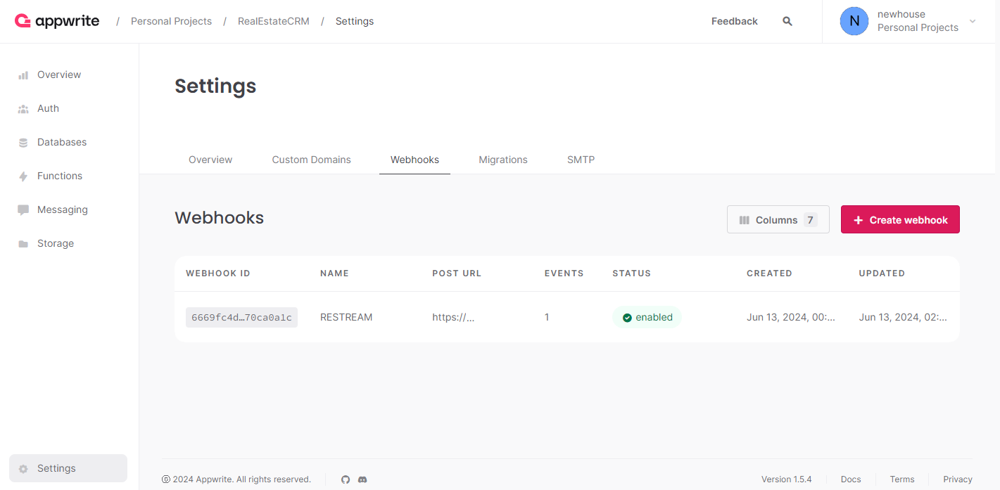

# appwrite-webhook-restreamer

> Appwrite Server SDK does not support realtime through WebSocket. Due to the limitations of automatic SDK generator, [looks like It would not ever support It](https://appwrite.io/threads/1180136902481952838). I am solved that problem by using [SockJS](https://github.com/sockjs/sockjs-client)

## Contribute

> [!IMPORTANT]
> There is another project named [react-declarative](https://github.com/react-declarative/react-declarative) build especially for AppWrite Realtime development. **⭐Star** and **💻Fork** It on github will be appreciated

# Setup

1. Start this microservice by using the next command

```bash
npx -y appwrite-webhook-restreamer
```

  or

```bash
npm install -g appwrite-webhook-restreamer
appwrite-webhook-restreamer
```

2. Setup [webhook](https://appwrite.io/docs/advanced/platform/webhooks) in the Appwrite instance settings. Use the next POST URL: `http://127.0.0.1:9999/emit`



3. Listen for events by using [any SockJS Client](https://github.com/sypbiz/SockJS.NET) with the next url: `http://127.0.0.1:9999/listen`. The following code might be useful

```tsx
import Socket from "sockjs-client";

import { Subject, singleshot } from "react-declarative";

...

export class RealtimeService {

  private readonly _sockjsSubject = new Subject<object>();

  private _init = singleshot(() => {
    new Socket("http://127.0.0.1:9999/listen").onmessage = (msg) => {
      const chunk = JSON.parse(msg.data);
      const data = {
        payload: chunk.payload,
        channels: [],
        events: chunk.events.split(","),
        timestamp: chusnk.timestamp,
      };
      this._sockjsSubject.next(data);
    };
  });

  subscribe = <T extends unknown>(
    channel: string,
    callback: (payload: RealtimeResponseEvent<T>) => void,
  ) => {
      this._init();
      return this._sockjsSubject.subscribe((payload) => {
        if (payload.events.some((event: string) => event.includes(channel))) {
          callback(payload);
        }
      });
  };
}
```

# CLI

The first command line argument is always a port. The second is the `disallowWs` flag (optional)

```bash
appwrite-webhook-restream 9999 [--disallowWs]
```
